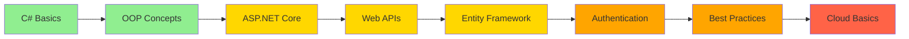

<div align="center">

<!-- Responsive Header -->
<div align="center">
  
</div>

<!-- Responsive Typing Animation -->
<picture>
  <source media="(max-width: 600px)" srcset="https://readme-typing-svg.demolab.com?font=Fira+Code&size=18&duration=3000&pause=1000&color=512BD4&center=true&vCenter=true&width=400&lines=Junior+.NET+Developer+%F0%9F%92%BB;Learning+%26+Growing+Every+Day+%F0%9F%8C%B1;Passionate+About+Clean+Code+%E2%9C%A8"/>
  
</picture>

<br/>

<!-- Social Links -->
<p align="center">
  <a href="https://www.linkedin.com/in/khader-mohamed-b1b395352?lipi=urn%3Ali%3Apage%3Ad_flagship3_profile_view_base_contact_details%3BAcX8rpAERmG2W%2BP9RFihNA%3D%3D">
    
  </a>
  <a href="khaderelhabal923@gmail.com">
    
  </a>
</p>

<!-- Profile Views -->


</div>

---

## 👨‍💻 About Me

<div align="center">

<table>
<tr>
<td width="50%" valign="top">

### 🚀 Developer Profile


**Name:** Khader Mohamed   
**Role:** Junior .NET Backend Developer  
**Location:** 📍 Gharbia, Egypt  

---

### 💻 Tech Stack

```
◆ C# ⚡
◆ SQL 🗄️
◆ JavaScript  
```

---

### 🎯 Current Focus

> *"Building solid foundations in .NET development and learning best practices"*

</td>
<td width="50%" valign="top">

### 🎓 Learning Goals

<br/>

```diff
+ ✅ Master C# fundamentals
+ 🔄 Master ASP.NET Core fundamentals
+ 🔄 Build RESTful APIs
+ ⏳ Understand database design
+ ⏳ Practice clean code principles
+ ⏳ Learn authentication & authorization
```

<br/>

### 📊 Journey Progress

<table width="100%">
<tr>
<td align="center">

<br/><b>100+</b>
<br/><sub>Hours Learning</sub>
</td>
<td align="center">

<br/><b>10+</b>
<br/><sub>Projects Built</sub>
</td>
<td align="center">

<br/><b>50+</b>
<br/><sub>Commits</sub>
</td>
</tr>
</table>

</td>
</tr>
</table>

</div>

### ⚡ Quick Highlights

<div align="center">

| 🌱 Learning | 💼 Building | 📚 Studying | ⚡ Fun Fact |
|:----------:|:-----------:|:-----------:|:----------:|
| ASP.NET Core & EF Core | Backend projects & APIs | Software engineering principles | Love solving LeetCode challenges |

</div>

---

## 🛠️ Technologies & Tools

<div align="center">

### Languages
<p>
  
  
  
</p>

### Frameworks & Libraries
<p>
  
  
  
</p>

### Databases
<p>
  
  
  
</p>

### Tools
<p>
  
  
  
  
</p>

</div>

---

## 📊 Learning Progress

<div align="center">

| Technology | Progress | Status |
|:-----------|:---------|:-------|
| C# Fundamentals | ✅ Strong |
| ASP.NET Core |  🔄 Learning |
| Entity Framework |  🔄 Learning |
| SQL & Databases | 🔄 Practicing |
| REST APIs | !🔄 Building |
| Git & Version Control | ✅ Comfortable |

</div>

---

## 🚀 Featured Projects


### 💡 More Projects

<details>
<summary><b>Click to see more projects</b></summary>
<br/>

- 📚 **Library Management System** - Console app with database connectivity
- 🎮 **Game API** - RESTful API for game data management
- 📊 **Student Records** - CRUD operations with ASP.NET Core MVC

</details>

</div>

---


---

## 🎯 My Learning Roadmap



**Legend:** 🟢 Completed | 🟡 Currently Learning | 🟠 Next Steps | 🔴 Future Goals

---

## 🌱 Currently Learning

<div align="center">

| Topic | Resource | Progress |
|:------|:---------|:---------|
| ASP.NET Core Fundamentals | Microsoft Learn | 🔄 In Progress |
| Entity Framework Core | Documentation | 🔄 In Progress |
| RESTful API Design | YouTube Tutorials | 🔄 In Progress |
| SQL Query Optimization | Practice Problems | 📝 Studying |
| Clean Code Principles | Robert C. Martin's Book | 📚 Reading |

</div>

---

## 💡 What I'm Working On

- 🔨 Building a personal blog API with ASP.NET Core
- 📖 Reading "Clean Code" by Robert C. Martin
- 🎯 Solving LeetCode problems daily
- 🌐 Learning about authentication and authorization
- 📚 Taking online courses on Udemy and Microsoft Learn

---

## 🤝 Let's Connect

<div align="center">

I'm always open to learning opportunities, collaborations, and connecting with other developers!

<p>
<a href="https://linkedin.com/in/your-profile">
  
</a>
<a href="mailto:your.email@gmail.com">
  
</a>
<a href="https://twitter.com/your-username">
  
</a>
</p>

---

### 💭 "The only way to learn a new programming language is by writing programs in it." - Dennis Ritchie

<br/>


**Thanks for visiting! ⭐ Star my repositories if you find them interesting!**

<br/>


</div>
